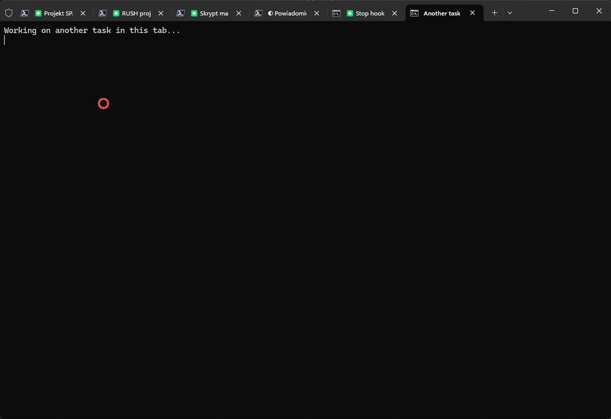

# claude-code-notify

Desktop notification whenever a [Claude Code](https://claude.com/claude-code) session finishes a turn or is waiting for you. Built for people who run several Claude Code tabs at once and want to know *which one* just finished.

<!-- Demo: record a short clip (several tabs, toast appears, click, terminal jumps to the tab),
     save it as docs/demo.gif and uncomment the line below. -->
<!--  -->

```
/plugin marketplace add MarekSwiechowicz/claude-code-notify
/plugin install notify@claude-code-notify
```

- **Windows**: native toast that stays on screen until you dismiss it, with the session title, the start of Claude's last message and a sound. **Clicking the toast jumps to that session's Windows Terminal tab.**
- **macOS**: Notification Center notification (title + last message).
- **Linux**: `notify-send`.

Fires on two hook events:

| Event | When |
|---|---|
| `Stop` | Claude finished its turn and is waiting for your next prompt |
| `Notification` (`permission_prompt`, `elicitation_dialog`) | Claude is asking for permission or asking you a question |

## Install

Inside Claude Code:

```
/plugin marketplace add MarekSwiechowicz/claude-code-notify
/plugin install notify@claude-code-notify
```

That is enough for notifications on every platform. On Windows, run once more to enable click-to-focus:

```
/notify:setup
```

It copies the click handler to `%LOCALAPPDATA%\claude-code-notify` and registers a `claudefocus:` URL protocol under `HKCU` (no administrator rights). Remove it later with `plugins/notify/uninstall.ps1`.

Requirements: Node.js on PATH (Claude Code needs it anyway), Git Bash on Windows (ships with Git for Windows), Windows Terminal for click-to-focus.

## Options

Set them in `~/.claude/settings.json`:

```json
{
  "env": {
    "CLAUDE_NOTIFY_LANG": "en",
    "CLAUDE_NOTIFY_SOUND": "1",
    "CLAUDE_NOTIFY_STICKY": "1",
    "CLAUDE_NOTIFY_FOCUS": "1"
  }
}
```

| Variable | Default | Meaning |
|---|---|---|
| `CLAUDE_NOTIFY_LANG` | `en` | `en` or `pl` for the toast labels |
| `CLAUDE_NOTIFY_SOUND` | `1` | `0` for a silent notification |
| `CLAUDE_NOTIFY_STICKY` | `1` | `1` keeps the Windows toast on screen until dismissed, `0` lets it fade |
| `CLAUDE_NOTIFY_FOCUS` | `1` | `0` disables click-to-focus |

Diagnostics go to `~/.claude/claude-notify.log`.

## How click-to-focus works (Windows)

1. While sending the toast, the hook resolves the tab index of the current session by matching the session title against the Windows Terminal tabs through UI Automation (`bin/tabindex.ps1`), and starts a hidden background helper (`bin/focus-watcher.ps1`, one instance per machine, exits when Windows Terminal closes).
2. The toast carries `claudefocus:<tab index>.<WT_SESSION>.<pid>.<title>`.
3. Clicking it launches `focus.ps1`, which writes a small request file. The helper picks it up, runs `wt.exe -w 0 focus-tab -t N` with the right `WT_SESSION` and brings the window to the front.

Why the indirection: a process launched from a toast click runs at medium integrity. If you run Windows Terminal as administrator, UIPI blocks that process from seeing or controlling the terminal window (and `wt.exe` would open a fresh window instead). The helper is started by the hook inside the terminal, so it inherits the terminal's privilege level and can do the job in both cases.

## Limitations

- Tabs are matched by title. Two sessions with the same title (for example two brand-new chats in the same folder, before Claude names them) resolve to the first one.
- Click-to-focus needs Windows Terminal. In other terminals the notification still shows, the click does nothing.
- One Windows Terminal window is assumed for the fallback path; with several windows the helper targets the window that hosts the session.
- Focus Assist / Do Not Disturb hides toasts in the notification center like any other app.

## Development

```
claude plugin validate .
claude --plugin-dir ./plugins/notify
```

Pipe-test the hook without a session:

```
echo '{"hook_event_name":"Stop","cwd":"'"$PWD"'"}' | bash plugins/notify/bin/notify.sh
```

## License

MIT
